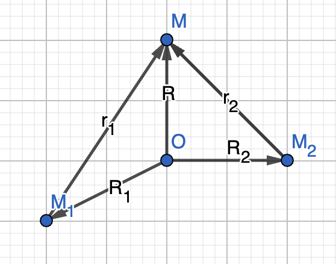

# three-body-problem

## Assumptions and setup
### Dimensions
Some of the program is set up to be scalable to higher dimensions, but here I primarily work in $\mathbb{R}_3$. 
### Bodies
Bodies are assumed to point masses so collision is not considered. Similarly to above, some of the program is set up to be scalable for $n$ bodies, but I mainly consider 3 bodies.
### Inertial frame of reference
It seems it is standard to have the center of mass of the system be the origin of the inertial frame, so that is what this project uses. However, I do so by adjusting some arbitrary initial positions and velocities such that the center of mass is at the origin and there is 0 net momentum, so the system can easily be converted to an arbitrary frame of reference.
Also, I leave the $z$ dimension as $0$ most of the time since we can adjust the frame of reference such that the orbital plane of the bodies is the $x$ - $y$ plane. 

## Derivation of differential equations

I couldn't easily find a derivation of the differential equations in the form of a document or a web page online (maybe because it is trivial to those who would actually study this), so here is mine. 

Consider arbitrary body $M$ in a three dimensional system with two other bodies, $M_1$ and $M_2$. 

$M$, $M_1$, and $M_2$ respectively have position vectors

$$\vec{R}=\begin{bmatrix}x \\\ y \\\ z\end{bmatrix},\quad\vec{R_1}=\begin{bmatrix}x_1 \\\ y_1 \\\ z_1\end{bmatrix},\quad\vec{R_2}=\begin{bmatrix}x_2 \\\ y_2 \\\ z_2\end{bmatrix}$$

Define the vector from $M_1$ to $M$ as $\vec{r_1}=\vec{R}-\vec{R_1}$ and the vector from $M_2$ to $M$ as $\vec{r_2}=\vec{R}-\vec{R_2}$.

$$
\begin{align*} 
F_{m_{net}} &= -\frac{Gmm_1}{|\vec{r_1}|^2}\hat{r_1} - \frac{Gmm_1}{|\vec{r_2}|^2}\hat{r_2} \\
m\ddot{\vec{R}} &= -\frac{Gmm_1}{|\vec{r_1}|^2}\left(\frac{1}{|\vec{r_1}|} \cdot \vec{r_1}\right) - \frac{Gmm_2}{|\vec{r_2}|^2}\left(\frac{1}{|\vec{r_2}|} \cdot \vec{r_2}\right) \\
\ddot{\vec{R}} &= -\frac{Gm_1}{|\vec{R}-\vec{R_1}|^3}(\vec{R}-\vec{R_1}) - \frac{Gm_2}{|\vec{R}-\vec{R_2}|^3}(\vec{R}-\vec{R_2})
\end{align*}
$$
Then for each coordinate, we have 

$$
\begin{align*} 
\ddot{x}&=-\frac{Gm_1}{|\vec{R}-\vec{R_1}|^3}(x-x_1) - \frac{Gm_2}{|\vec{R}-\vec{R_2}|^3}(x-x_1)\\
\ddot{y}&=\cdots\\
\ddot{z}&=\cdots 
\end{align*}
$$

For an $n$-body system, we have
$$\ddot{\vec{R}} = \sum_{i=1}^{n-1}-\frac{Gm_i}{|\vec{R}-\vec{R_i}|^3}(\vec{R}-\vec{R_i})$$
but we will mainly consider 3 bodies.

## Solving ODEs with SciPy

### `solve_ivp`
In order to use `scipy.integrate.solve_ivp` to solve the initial value problem, we need a function that returns an array of first order differential equations. Given that our primary equation is a second order differential equation, we change it to two first order differential equations. 

$$
\begin{align}
\ddot{\vec{R}} = \frac{d\vec{v}}{dt} \implies \frac{d\vec{v}}{dt} &= -\frac{Gm_1}{|\vec{R}-\vec{R_1}|^3}(\vec{R}-\vec{R_1}) - \frac{Gm_2}{|\vec{R}-\vec{R_2}|^3}(\vec{R}-\vec{R_2})\\
\frac{d\vec{R}}{dt} &= \vec{v}
\end{align}
$$

These along with the intial values for position and velocity allow us to simulate the system over a given time interval. 