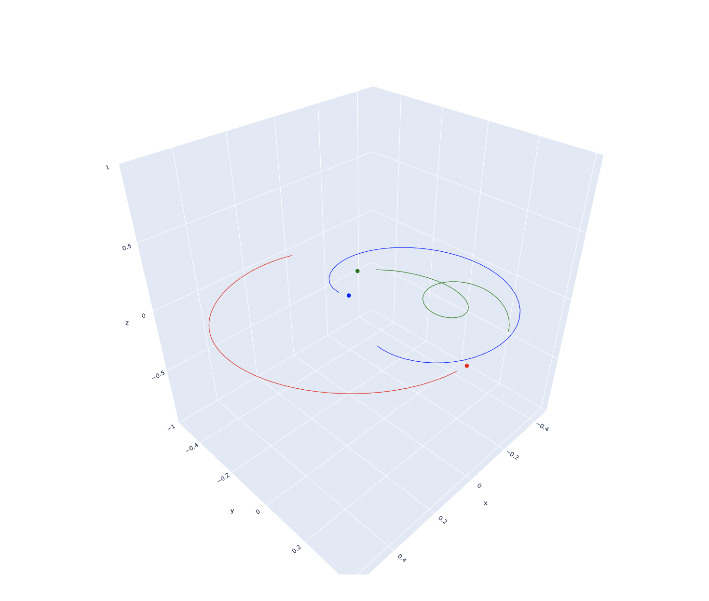

# three-body-problem
Program to visualize the three body problem. 

## Assumptions and setup
### Dimensions
Some of the program is set up to be scalable to higher dimensions, but here I primarily work in $\mathbb{R}_3$. 
### Bodies
Bodies are assumed to point masses so collision is not considered. Program is set up to be scalable for $n$ bodies, but I mainly consider 3 bodies.
### Inertial frame of reference
It seems it is standard to have the center of mass of the system be the origin of the inertial frame, so that is what this project uses. However, I do so by adjusting some arbitrary initial positions and velocities such that the center of mass is at the origin and there is 0 net momentum, so the system can easily be converted to an arbitrary frame of reference.
Also, I leave the $z$ dimension as $0$ most of the time since we can adjust the frame of reference such that the orbital plane of the bodies is the $x$ - $y$ plane. 

## Derivation of differential equations

I couldn't easily find a derivation of the differential equations in the form of a document or a web page online (maybe because it is trivial to those who would actually study this), so here is mine. 

Consider arbitrary body $M$ in a three dimensional system with two other bodies, $M_1$ and $M_2$. 

$M$, $M_1$, and $M_2$ respectively have position vectors

$$\vec{R}=\begin{bmatrix}x \\\ y \\\ z\end{bmatrix},\quad\vec{R_1}=\begin{bmatrix}x_1 \\\ y_1 \\\ z_1\end{bmatrix},\quad\vec{R_2}=\begin{bmatrix}x_2 \\\ y_2 \\\ z_2\end{bmatrix}$$

Define the vector from $M_1$ to $M$ as $\vec{r_1}=\vec{R}-\vec{R_1}$ and the vector from $M_2$ to $M$ as $\vec{r_2}=\vec{R}-\vec{R_2}$.

$$
\begin{align*} 
F_{m_{net}} &= -\frac{Gmm_1}{|\vec{r_1}|^2}\hat{r_1} - \frac{Gmm_1}{|\vec{r_2}|^2}\hat{r_2} \\
m\ddot{\vec{R}} &= -\frac{Gmm_1}{|\vec{r_1}|^2}\left(\frac{1}{|\vec{r_1}|} \cdot \vec{r_1}\right) - \frac{Gmm_2}{|\vec{r_2}|^2}\left(\frac{1}{|\vec{r_2}|} \cdot \vec{r_2}\right) \\
\ddot{\vec{R}} &= -\frac{Gm_1}{|\vec{R}-\vec{R_1}|^3}(\vec{R}-\vec{R_1}) - \frac{Gm_2}{|\vec{R}-\vec{R_2}|^3}(\vec{R}-\vec{R_2})
\end{align*}
$$

For an $n$-body system, we have
$$\ddot{\vec{R}} = \sum_{i=1}^{n-1}-\frac{Gm_i}{|\vec{R}-\vec{R_i}|^3}(\vec{R}-\vec{R_i})$$
but we will mainly consider 3 bodies.

## Solving ODEs with SciPy's `solve_ivp`
### Solver is limited to first-order
In order to use `scipy.integrate.solve_ivp` to solve the initial value problem, we need a function that returns an array of first order differential equations. Given that our primary equation is a second order differential equation, we change it to two first order differential equations. 

$$
\begin{align}
\ddot{\vec{R}} = \frac{d\vec{v}}{dt} \implies \frac{d\vec{v}}{dt} &= -\frac{Gm_1}{|\vec{R}-\vec{R_1}|^3}(\vec{R}-\vec{R_1}) - \frac{Gm_2}{|\vec{R}-\vec{R_2}|^3}(\vec{R}-\vec{R_2})\\
\frac{d\vec{R}}{dt} &= \vec{v}
\end{align}
$$

These along with the intial values for position and velocity allow us to simulate the system over a given time interval. 

### Parameters

In `solve_ivp`, we pass a a function (`differential_equations`) that returns the derivatives of the positions and the velocities of the bodies in the system for explicit time instances given an initial state. Since we use the masses when computing acceleration, we also pass the masses of the bodies an additional argument. 

`solution = solve_ivp(self.differential_equations, t_span, initial_state, args=(masses,), t_eval=t_eval)`

`solution` is an object with various attribute, of which `y` is an array with the position and velocity of each body at each explicit time instance.

## Visualization

Not much to it, this part was pretty quick. I found `plotly`'s `Scatter3d` to be effective for animating the phenomenon. I am considering making a web page to input masses, initial positions, and initial velocities to make exploration of the phenomenon more accesible and user friendly.

## Observations
### Need mass to be similar order of magnitude as G
Initially, I had the masses set to values within a few orders of magnitude of 1. I noticed that the masses were moving in straight lines and acceleration was not changing at all over long time intervals. I thought there was something wrong with my implementation, but I eventually noticed the order of magnitudes of the acceleration values and realized the issue. So the phenmenon is not very interesting without sufficiently strong gravitational forces.

### Limitations

The issue with the three body problem or n body problem in real life is that our measurements will always have some degree of error, and even small changes to initial values can result in large variations. This Python program does not have infinite decimal precision and ultimately also has a degree of error.